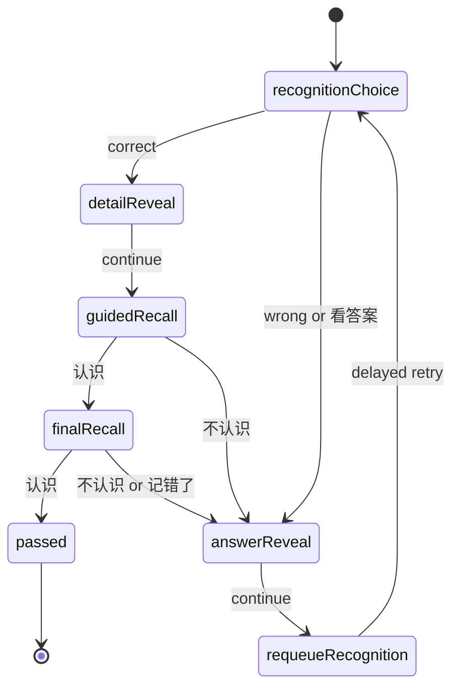
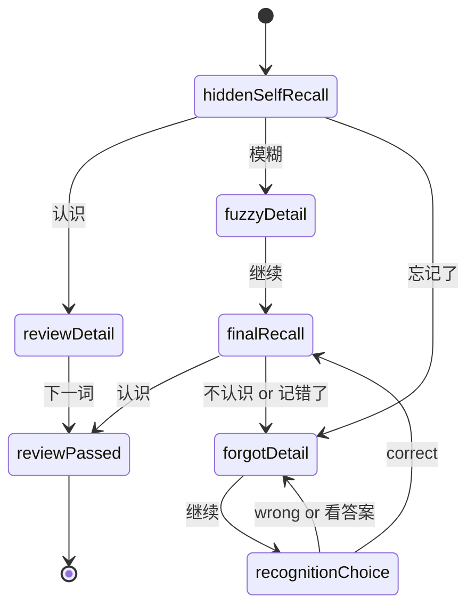
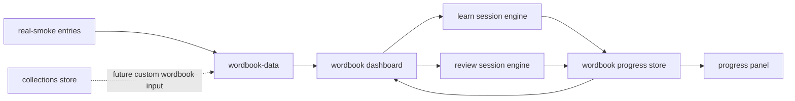

# Wordbook Learn / Review State Machine Design

## Status

Drafted on 2026-05-30 after reviewing the 不背单词 screenshots and EngGo's current learning-surface code.

This spec supersedes the first-cut recommendation in `2026-05-30-vocabulary-learning-first-direction.md` that framed the next step as a local collected-word review loop. The revised direction is:

**Start from the core wordbook learning flow, with collections as a supporting asset rather than the first product object.**

## Verdict

The 不背单词 flow can be copied at the product-logic level.

What is worth copying:

- User chooses an active wordbook.
- Home exposes two primary jobs: `Learn` for new words and `Review` for due words.
- Each session is a short queue, default 10 words.
- A word does not pass after one tap. It moves through a small state machine.
- New-word learning starts with recognition, then shows explanation, then asks again later.
- Review starts with no-prompt self recall, then branches by remembered / fuzzy / forgotten.
- Wrong or forgotten words are requeued inside the same session.
- A compact progress marker near the word shows how close that word is to passing.

What must not be copied:

- Do not copy 不背单词's proprietary wordbook content, examples, audio, icons, mascots, illustrations, exact visual skin, or proprietary wording.
- Do not claim EngGo has 不背单词's real-usage corpus or mature spaced-repetition algorithm in V1.
- Do not turn the learning flow into another chat surface.

The EngGo V1 should therefore implement a **wordbook-driven local state machine**, not a pixel clone and not a full SRS system.

## Stakeholder Context

The user wants EngGo to move from "a chat app that can answer vocabulary questions" into "an app I can actually use to memorize words." The screenshots make the product requirement sharper than the previous spec: the central object is not the collected-word notebook, but a selected wordbook with `Learn` and `Review` queues.

From a product perspective, the important shift is that the first screen after navigation should let a learner continue a concrete daily task: learn new words or review old ones. From an engineering perspective, this is attractive because the core loop can be implemented without model calls, DB migrations, accounts, or cloud sync.

## Current State Verified

Verification date: 2026-05-30.

| Area | Current state | Evidence |
|---|---|---|
| Direction doc | The latest direction doc still says the first stage should be `Wordbook Review V1` from existing local collections. This is now too small and should be superseded by this spec. | `docs/superpowers/specs/2026-05-30-vocabulary-learning-first-direction.md` |
| Navigation | Secondary nav already has `/collections`, `/learn`, `/review`, and `/progress`. | `src/components/shell/app-nav.tsx:3` |
| Learn surface | `/learn` exists but only shows the active exam target and placeholder copy. | `src/features/collections/study-panels.tsx:194` |
| Review surface | `/review` exists but only shows placeholder copy for future review flow. | `src/features/collections/study-panels.tsx:227` |
| Collections store | Local collections are persisted in `enggo.collectedWords`, grouped by exam target, with lemma, note, POS, short meaning, source kind, review status, and timestamp. | `src/features/collections/collection-store.ts:6` |
| Collection actions | The current repository supports add/list/remove only; there is no learning state or session state. | `src/features/collections/collection-store.ts:26` |
| Existing content | `real-smoke` has 546 source-backed entries and 34 manually reviewed confusion groups; it is a thin development slice, not a full teaching corpus. | `data/exam-vocab/real-smoke/README.md:43` |
| Source-lemma boundary | Source lemma files are provenance aids, not EngGo teaching content; gaokao and CET lemma manifests exist, but postgrad remains source-blocked. | `data/exam-vocab/source-lemmas/README.md:3`, `data/exam-vocab/source-lemmas/README.md:21` |
| Active exam targets | EngGo supports `gaokao`, `cet4`, `cet6`, and `postgrad`; default target is `cet6`. | `src/features/exam-target/model.ts:1` |

## Product Scope

### V1 Name

`Wordbook Learn/Review V1`

### Primary User Flow

1. User opens the Learn/Review area.
2. User sees the active wordbook card:
   - wordbook name
   - total words
   - learned count
   - learn count available today
   - review count due
3. User starts `Learn` or `Review`.
4. Session opens a full-screen study card.
5. User completes words through the state machine.
6. Results are written to local storage immediately after each answer.
7. User returns later and sees updated counts.

### V1 Default Wordbook

V1 should ship one default wordbook:

`cet6-foundation-v1`

Source:

- Use `data/exam-vocab/real-smoke/entries.json`.
- Include entries whose `examScopes` include `cet6`.
- Keep the public source-backed boundary visible in code and tests.
- Display product copy as "CET-6 基础词书 V1" or similar; do not call it a complete official CET-6 wordbook.

Why this wordbook:

- `cet6` is the current default exam target.
- The screenshots and user examples are CET-6-like.
- The project already has source-backed CET data and Chinese meanings.
- It avoids copying commercial wordbook content.

Postgrad handling:

- If the active exam target is `postgrad`, V1 should still default to `cet6-foundation-v1` and show a small boundary note in the wordbook picker: "考研词书还没接入可机读来源，先用 CET-6 基础词书 V1。"
- Do not fabricate a postgrad wordbook.

## Functional Requirements

### Wordbook Home

The learning home should replace the current placeholder content in `/learn` and `/review` with one shared wordbook dashboard.

Required elements:

- Active wordbook card.
- `Learn` action with count of unseen / learning words available.
- `Review` action with count of due review words.
- Progress bar: passed words / total words.
- A small route to Collections, but collections must be secondary.

V1 does not need a full wordbook marketplace. A simple active-wordbook card is enough.

### Learn Session

Learn is for words not yet passed in the active wordbook.

Session defaults:

- Start with up to 10 target words.
- Pull from `unseen` first, then `learning` words that failed previously.
- A session may show more than 10 cards because failed words reappear.
- Progress label should count target words passed, not raw card exposures.

New-word state machine:



Card stages:

| Stage | User sees | User action | State effect |
|---|---|---|---|
| `recognitionChoice` | word, pronunciation text if available, 4 Chinese meaning options | choose one or `看答案` | correct adds 1 mastery dot; wrong adds 0 and reveals answer |
| `detailReveal` | Chinese meanings, example if available, collocations if available | `继续` | prepares delayed recall |
| `guidedRecall` | word plus a light hint or example context | `认识` / `不认识` | `认识` adds 1 mastery dot; fail requeues |
| `finalRecall` | word only, no visible meaning | `认识` / `不认识` | `认识` adds final dot and passes; fail requeues |

Passing rule:

- Each new word needs 3 mastery dots in one session to pass.
- If the learner fails at any stage, the word loses the current attempt stage and is requeued after at least 3 other card exposures when possible.
- If fewer than 3 other cards remain, requeue at the end.
- A word with 3 failed attempts in one session is allowed to remain `learning` and not block session completion forever.

### Review Session

Review is for words that have passed before and are due for recall.

Review starts harder than Learn: it asks the learner to self-recall before showing meaning.

Review state machine:



Review outcomes:

| First action | Expected flow | Persisted effect |
|---|---|---|
| `认识` | Show detail, then user can go next | keep / increase review strength; schedule later |
| `模糊` | Show detail, then final recall later | keep in today's review queue until final recall passes |
| `忘记了` | Show detail, then fall back into recognition choice and final recall | mark lapse, requeue today |

This matches the user's examples:

- `commerce`: user taps remembered, sees detail, can go next.
- `banquet`: user taps forgotten, sees detail, then the word comes back in a lower-confidence test.

### Multiple-Choice Generation

Every recognition choice must show 4 options:

- 1 correct meaning from the current word.
- 3 distractors from the same active wordbook.

Distractor rules:

1. Prefer same part of speech when available.
2. Prefer similar meaning length so the correct answer is not visually obvious.
3. Exclude the same lemma, duplicate Chinese meaning strings, and empty meanings.
4. If same-POS candidates are insufficient, fall back to any same-wordbook candidates.
5. If the wordbook still cannot provide 3 distractors, do not start the card; mark the word as `blockedContent` and skip it.

Shuffle should be deterministic per `sessionId + lemma + stageAttempt`, so tests can assert behavior without making the UI predictable across sessions.

### Progress Dots

Use three progress dots next to the word for V1.

Meaning:

- 0 dots: word has not passed any current-session check.
- 1 dot: first recognition passed.
- 2 dots: guided recall passed.
- 3 dots: final recall passed; word is passed for this session.

For review words:

- Existing mastered words can start with neutral dots or hidden dots; once the review starts, dots represent current-session confirmation, not lifetime mastery.
- A green completion badge can appear after `reviewPassed`.

### Local Persistence

Use localStorage for V1. Do not add Prisma schema or account state.

Suggested keys:

- `enggo.activeWordbook.v1`
- `enggo.wordbookProgress.v1`
- `enggo.studySessionDraft.v1`

The progress store should be separate from `enggo.collectedWords`. Collections can later feed custom wordbooks, but V1 should not overload the collection schema.

Proposed types:

```ts
type WordbookId = "cet6-foundation-v1";

type WordbookEntry = {
  id: string;
  lemma: string;
  aliases: string[];
  pos: string[];
  meaningsZh: string[];
  examScopes: Array<"gaokao" | "cet4" | "cet6" | "postgrad">;
  examples: string[];
  collocations: string[];
};

type WordStudyStatus =
  | "unseen"
  | "learning"
  | "passed"
  | "reviewing"
  | "lapsed"
  | "blockedContent";

type WordStudyProgress = {
  wordbookId: WordbookId;
  lemma: string;
  status: WordStudyStatus;
  masteryDots: 0 | 1 | 2 | 3;
  reviewStrength: 0 | 1 | 2 | 3;
  seenCount: number;
  correctCount: number;
  wrongCount: number;
  lastSeenAt?: string;
  nextReviewAt?: string;
  updatedAt: string;
};
```

V1 review scheduling:

- `passed` from Learn sets `nextReviewAt` to the next local day.
- `认识` in Review increases `reviewStrength` by 1 up to 3.
- `模糊` keeps `reviewStrength` unchanged and sets `nextReviewAt` to today until final recall passes.
- `忘记了` decreases `reviewStrength` by 1 down to 0 and sets status to `lapsed`.
- Use rough day offsets only: strength 0 -> today, 1 -> tomorrow, 2 -> 3 days, 3 -> 7 days.

This is not a full forgetting curve. It is enough to make Review counts meaningful.

## Architecture

### New Modules

| File | Purpose |
|---|---|
| `src/features/wordbook/wordbook-types.ts` | Shared wordbook and progress types. |
| `src/features/wordbook/wordbook-data.ts` | Loads the V1 static wordbook from existing source-backed entries. |
| `src/features/wordbook/wordbook-progress-store.ts` | localStorage repository for active wordbook and per-word progress. |
| `src/features/wordbook/session-engine.ts` | Pure state machine for Learn and Review sessions. |
| `src/features/wordbook/distractors.ts` | Builds deterministic 4-option meaning choices. |
| `src/features/wordbook/wordbook-dashboard.tsx` | Dashboard card and Learn/Review entry actions. |
| `src/features/wordbook/study-session.tsx` | Full session UI for Learn and Review. |

### Existing Files To Touch

| File | Change |
|---|---|
| `src/features/collections/study-panels.tsx` | Replace placeholder `LearnPanel` and `ReviewPanel` with wordbook dashboard/session mounts, or move panels to `src/features/wordbook` and re-export. |
| `src/app/learn/learn-client.tsx` | Load the new Learn panel. |
| `src/app/review/review-client.tsx` | Load the new Review panel. |
| `src/app/progress/progress-client.tsx` / `ProgressPanel` | Show wordbook progress after the store exists. |
| `docs/README.md` | Mark this spec as the current vocabulary-learning design. |
| `progress.md` | Replace the old "local collection review first" next step with this state-machine direction. |

### Data Flow



Collections remain useful, but they are not the V1 source of truth for the core learning loop.

## UX Requirements

Borrow the interaction shape, not the visual skin:

- Large word near the upper-middle of the session card.
- Pronunciation text under the word when available.
- Three small progress dots beside or near the word.
- Bottom actions should be few and decisive.
- Correct state uses green; failure / forgotten state uses red.
- The card should feel focused and quiet, not like a dashboard.

V1 screens:

1. Wordbook dashboard.
2. Learn `recognitionChoice`.
3. Learn / Review detail reveal.
4. Review hidden self recall.
5. Session completion summary.

Avoid in-app explanatory paragraphs. Use short labels and stateful controls.

## Error Handling

- If no wordbook entries are available, show a local empty state and do not start a session.
- If a word lacks Chinese meanings, mark it `blockedContent` and skip.
- If distractors cannot be built, mark it `blockedContent` and skip.
- If localStorage is unavailable, allow read-only demo display but do not claim progress was saved.
- If persisted progress references a missing lemma, ignore that progress record during dashboard counts.
- If a session is refreshed, V1 may restart the session from persisted word progress; it does not need exact card-level resume.

## Acceptance Criteria

1. `/learn` shows a wordbook dashboard for `cet6-foundation-v1` with total, learned, learnable, and due-review counts.
2. Starting Learn opens a 10-word target session from unseen / learning words.
3. Learn recognition cards show exactly 4 Chinese options with 1 correct answer and 3 valid distractors.
4. A new word only becomes `passed` after completing 3 mastery dots in the Learn session.
5. A wrong Learn answer reveals the correct meaning and requeues the word before it can pass.
6. `/review` starts due words with hidden self recall and actions `认识`, `模糊`, `忘记了`.
7. Review `认识` shows the detail card and then passes the word for this review.
8. Review `忘记了` shows the detail card, sends the word through recognition / final recall again, and persists a lapsed or reduced-strength state.
9. Counts persist after page reload via localStorage.
10. Collections still display and delete existing collected words exactly as before.
11. No model/provider call is required for Learn or Review V1.
12. No Prisma schema or backend endpoint is required for Learn or Review V1.

## Testing Plan

| Layer | What | Count |
|---|---|---|
| Unit | `distractors.ts`: correct option + 3 distractors, same-POS preference, duplicate exclusion, deterministic shuffle | +5 |
| Unit | `wordbook-progress-store.ts`: hydrate, legacy-safe empty fallback, write progress, ignore missing lemmas | +5 |
| Unit | `session-engine.ts`: Learn correct path, Learn wrong requeue, 3-dot pass, Review remembered path, Review forgotten path | +8 |
| Component | Wordbook dashboard count rendering and Learn/Review buttons | +3 |
| Component | Learn card interactions across recognition, detail, guided recall, final recall | +4 |
| Component | Review card interactions for remembered and forgotten flows | +4 |
| Regression | Existing collection-store and collection panel tests keep passing | existing |

Manual browser check after implementation:

- Mobile width around 390px: no horizontal overflow, action buttons fit.
- Desktop width: session card remains focused and does not become a marketing page.
- Reload after several answers: dashboard counts reflect persisted progress.

## Rollback Plan

Because V1 is localStorage-only:

- Revert the feature files and route panel changes.
- Leave `enggo.wordbookProgress.v1` ignored by old code.
- Existing `enggo.collectedWords` remains untouched and should still work.

If a local test needs reset:

- Clear `enggo.wordbookProgress.v1`, `enggo.studySessionDraft.v1`, and `enggo.activeWordbook.v1`.
- Do not clear `enggo.collectedWords` unless testing collection behavior explicitly.

## Effort Estimate

| Part | Estimate |
|---|---|
| Wordbook data adapter and types | 0.5 day |
| Local progress store | 0.5 day |
| Distractor builder | 0.5 day |
| Learn session engine | 1 day |
| Review session engine | 0.75 day |
| Dashboard and session UI | 1.5 days |
| Tests and manual verification | 1 day |

Total: about 5 to 6 focused engineering days.

## Out Of Scope

- Full official CET-6 / postgrad commercial-quality wordbook.
- 不背单词 visual clone, copied examples, copied word groups, copied audio, or copied UI assets.
- Account system, cloud sync, cross-device state.
- Full spaced-repetition algorithm.
- Audio playback beyond existing pronunciation text.
- AI-generated examples or explanations inside the study session.
- User-created custom wordbooks from collections.
- Importing external wordbook files.
- Daily streak, calendar, social features, or gamification beyond minimal session progress.

## Follow-Up Plan Boundary

The implementation plan after this spec should be named something like:

`2026-05-30-wordbook-learn-review-v1.md`

It should start with pure data/state modules before UI:

1. Wordbook data adapter.
2. Progress store.
3. Distractor builder.
4. Session engine.
5. Learn/Review UI.
6. Progress/collection regression checks.

Do not begin by polishing the UI shell. The core risk is the state machine.
